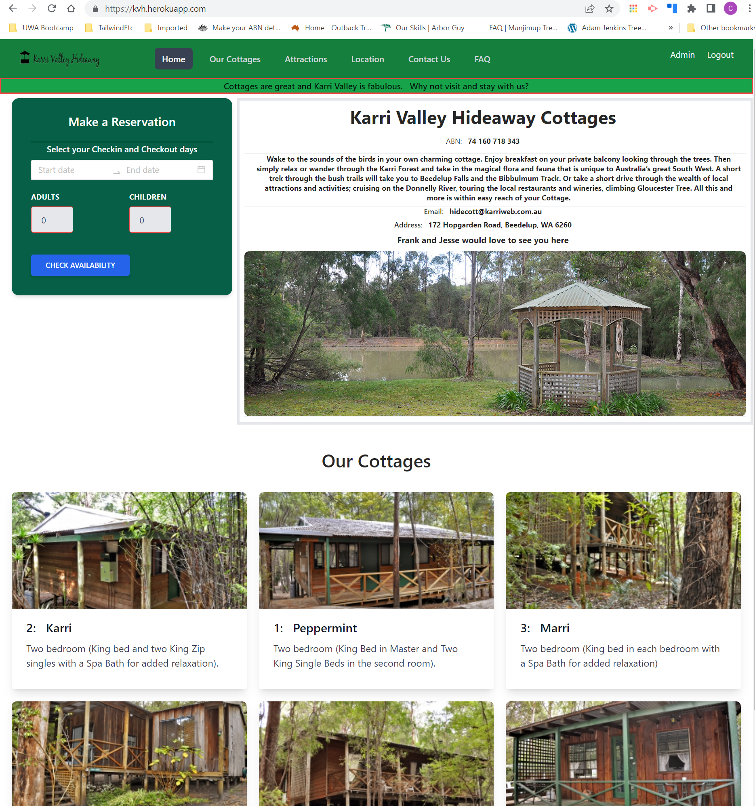

# Cottage Bookings
Responsive Accommodation Website and Booking Application

  

## Description

The responsive application allows visitors to browse the Site and then to book accommodation once happy that it meets their needs.  In order to finalise a booking, a visitor must create a User profile.  Once the User profile is complete, a logged in Guest can view their bookings, current and previous, and also view their profile.  The application uses the MERN stack, with a GraphQl/Apollo middleware arrangement.  Users with 'admin' privileges can view and update bookings (update/confirm/cancel), property details, cottage/room details and users (determining who should have admin privileges).  
The application is currently a work in progress.  

 
  
## Table of Contents

- [Installation](#installation-notes)
- [Usage](#usage)
- [Features](#features)
- [Credits](#credits)
- [Contributing](#contributing)
- [Questions](#questions)
- [License](#license)

 

## Installation Notes  

  The application is deployed on Heroku using MongoDB and Atlas.  
  The application can be cloned to a personal computer at this point in time.  Once on your computer, use Node to setup.  npm i will initiate the root package.  After that, run the following scripts:  'npm run install', followed by 'npm run seed' and then 'npm run develop'.  The application should open automatically on your browser, using the localhost.  Use React Version 17 as it has not yet been tested on later React versions.  This also applies to the other packages in the package.json files.   

 

## Usage 

  Once complete, the application will be completely intuitive for users.  Note that User profiles cannot be viewed unless the User has logged in (the menu access will only appear once logged in).  Likewise, the Administrator console only becomes available once a User with 'admin' privileges has logged in.   

  The application is deployed at:  https://kvh.herokuapp.com/
 
   

  The Git repository for the applicaton is held at:  https://github.com/Cancer2806/KVH.

 

  Following are screenshots showing the application in use:  

Landing Page:
 
  
This screen provides an initial view of the cottages available, and provides a component for booking in.  The Navbar is universal across the application, with the logging in and logged in menus appearing to the right.   

 

Login:
 
  
Screen to allow registered users to log in.   

 

Administrator Console:
 
  
The administrator's console provides tabs which each show key information.   

 

## Features  

  Users passwords are encrypted using bcrypt.  JWT Tokens are used for User authentication.  DotEnv has been used to secure key details.  Responsivenes, and Navbar changes to suit the logged in status are also considered features.  Once operational, the booking in system will also be a key feature.   

 

## Credits  

  The application was initially developed as the final project for the UWA Full Stack Web Developers Bootcamp.  
  Heroku and Atlas were used for Deployment of the App.  The app makes use of the full MERN stack (Mongo, Express, React, Node).  Apollo and GraphQL were used for route control and database access.  
  Tailwind / HeadlessUI have been used for styling, whilst Antd provided the Datepicker and Tab components.      
  Youtube videos by Traversy Media, Pedro Tech and Academind were also useful.  The Udemy MERN Stack: Hotel Booking App with React, Node, Mongo 2021 was also useful for initial guidance, although it is structured differently and does not use GraphQl/Apollo.

 

## Contributing  

  Please advise by email if there are any contributions or suggestions you'd like to make.      

 

## Questions
Please use email for any questions you may have   

Github:  https://github.com/Cancer2806

Email:  frank.lavery@westnet.com.au

 

## License
This project is licensed under [MIT](https://opensource.org/licenses/MIT).

